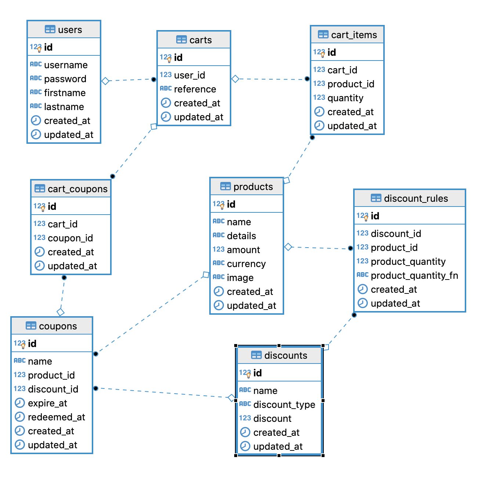
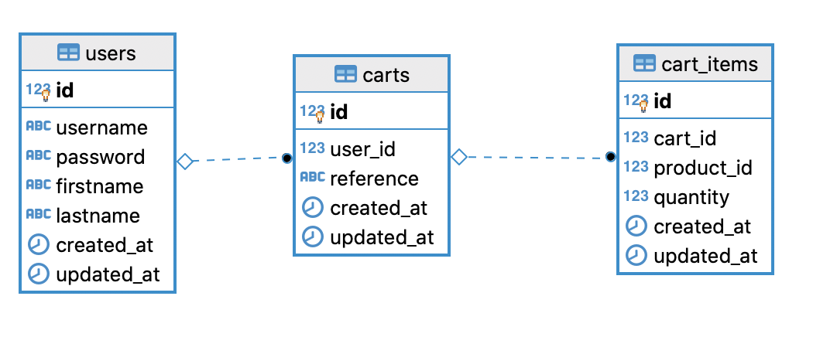
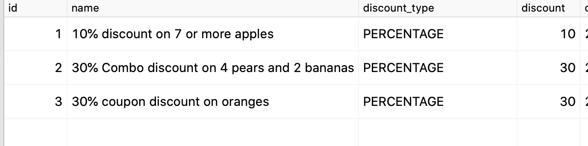
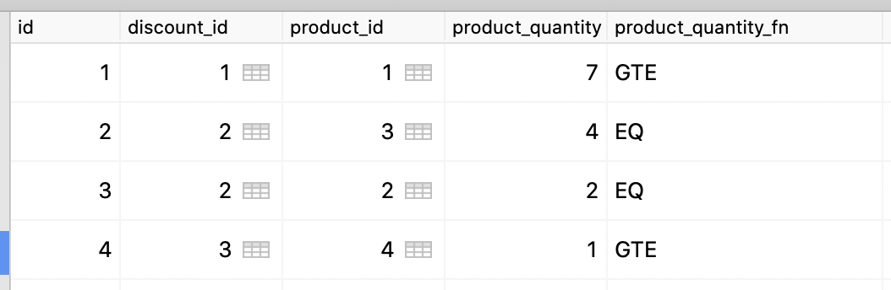
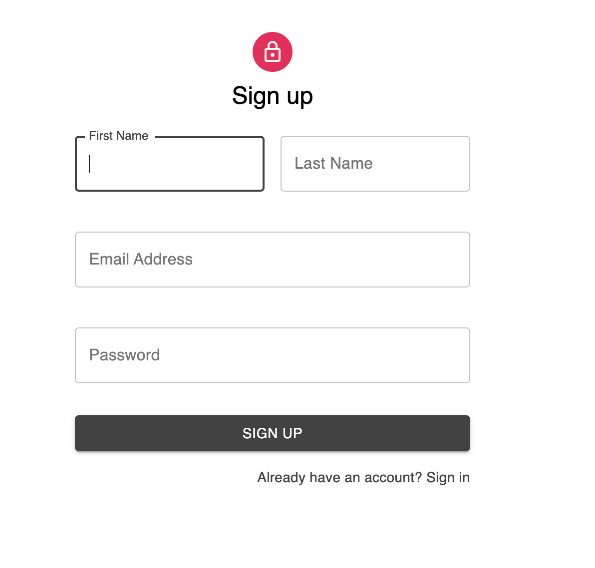
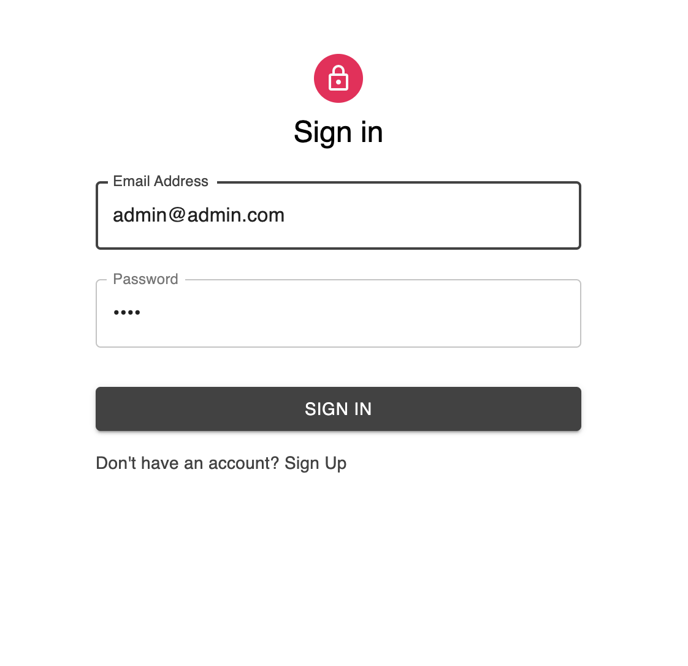
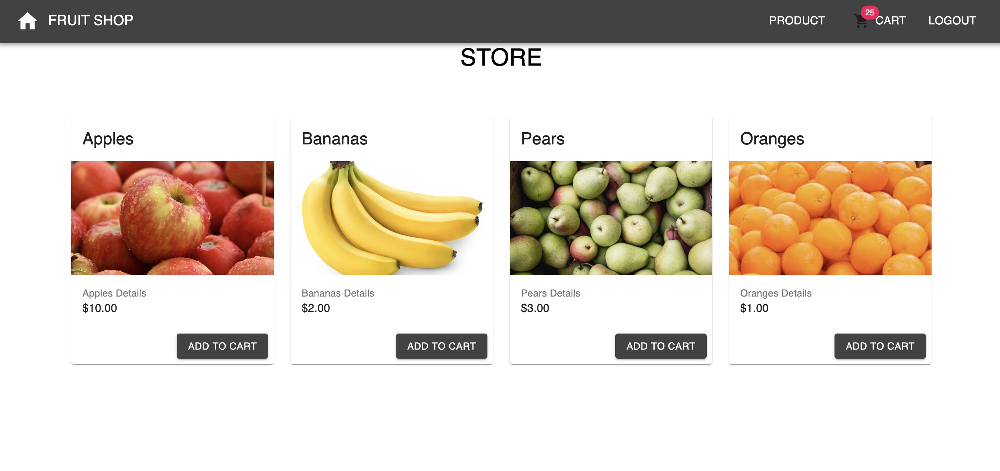
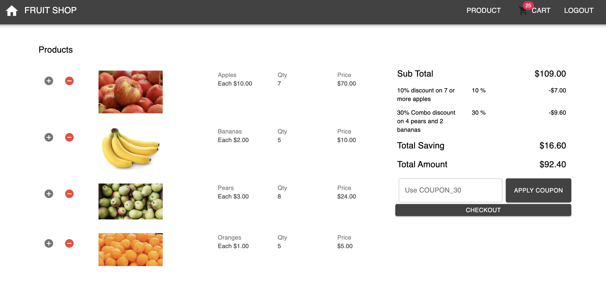

### Quick Setup

1. Git clone this project `git clone git@github.com:parmod-arora/shopping-cart.git shopping-cart`
2. `cd shopping-cart`
3. Build project `docker-compose build`
4. Run project `docker-compose up`

**Run test locally**
run `make test`

**Backend Tech Stack**

- Golang 
- Postgres
- Golang Migrate
- SqlBoiler ( ORM library)
- Gorilla MUX (HTTP router)
- Docker

### Database Design

> Users must be able to return to their cart after closing the browser, and see the previous items that were added.

Above problem can be solved using below options

1. We can save cart information on client side  i.e localstorage and when user return to their cart after closing broswer we can show the cart information

But, above approach has it's limitation, Information will not be accessible when user use another browser/device to access shopping cart.

2. Persist cart infomation in database, using this approach user cart information will be accessible to user on any device 

**Cart Rules**

>If 7 or more apples are added to the cart, a 10% discount is applied to all apples.

>For each set of 4 pears and 2 bananas, a 30% discount is applied, to each set. (These sets must be added to their own cart item entry.) If pears or bananas already exist in the cart, this discount must be recalculated when new pears or bananas are added.

> A coupon code can be used to get a 30% discount on oranges, if applied to the cart, otherwise oranges are full price.

For cart rules we need flexible design so that it can handle the current cart rules requirement.
as well as it also take care of future offers on different products and combination of products

1. `discounts` - Store discount related information 
  - `discounts.discount_type` will hold type information discount e.g. `FLAT` | `PERCENTAGE`
  e.g. $5 discount or 5% discount

2. `discount_rules` - this table stores discount constraints.
  - `discount_rules.product_id` determines offer need to apply on which product
  - `discount_rules.product_quantity` and  `discount_rules.product_quantity_fn` `GTE|EQ|LTE` determines the quantity comparison with value
  e.g. 
  1. discount need to apply when quanity 7 or more `[GTE, 7]`
  1. discount need to apply when quantity is exact 7 `[EQ, 7]`
  1. discount need to apply when quantity is less to 7 `[LTE, 7]`

In future if we want to apply new offers on any product with same or differnt quanity we can insert new record in db.

Suppose we have 4 product rules on an offer, In that case we will insert 4 records in `discount_rules` table

*Another use case can be like*
10% off on combination if user choose any of product from [A|B] and C

In this case we will create 2 offers in DB with each possibility 
1st offer will be [A] and [C]
2nd offer will be [B] and [C]

Apart from that same existing discount db structure will work with coupons/promotion codes also.

### Aplication routes

| API            | Method|               Url|
|----------------|------|--------------------|
| Login          | POST |/api/v1/users/login |
| Signup         | POST |/api/v1/users/signup|
| List Products  | GET  |/api/v1/products/|
| List Cart Items| GET  |/api/v1/carts/items|
| Add Cart Items | PUT  |/api/v1/carts/items|
| Add Coupons    | POST |/api/v1/carts/coupon/add|
| Remove Coupons | POST |/api/v1/carts/coupon/remove|
| Checkout Cart  | POST |/api/v1/carts/checkout|

**Go Project Layout**

Assignment project layout is based upon [golang-standards/project-layout](https://github.com/golang-standards/project-layout) it is a set of common historical and emerging project layout patterns in the Go ecosystem

**Why SQLBoiler Orm** 

Choice is simple in this case, [SQLBoiler](https://github.com/volatiletech/sqlboiler) is a "database-first" ORM as opposed to "code-first" (like gorm/gorp). That means you must first create your database schema.

The models package is type safe. This means no chance of random panics due to passing in the wrong type. No need for interface{}.

types closely correlate to your database column types. This is expanded by our extended null package which supports nearly all Go data types.

### UI Design
**Sign Up**

**Login page**

**Listing Product page**

**Checkout page**

# Getting Started with UI App

This project was bootstrapped with [Create React App](https://github.com/facebook/create-react-app).

## Available Scripts

In the project directory, you can run:

### `yarn start`

Runs the app in the development mode.\
Open [http://localhost:3000](http://localhost:3000) to view it in the browser.

The page will reload if you make edits.\
You will also see any lint errors in the console.

### `yarn test`

Launches the test runner in the interactive watch mode.\
See the section about [running tests](https://facebook.github.io/create-react-app/docs/running-tests) for more information.

### `yarn build`

Builds the app for production to the `build` folder.\
It correctly bundles React in production mode and optimizes the build for the best performance.

The build is minified and the filenames include the hashes.\
Your app is ready to be deployed!

See the section about [deployment](https://facebook.github.io/create-react-app/docs/deployment) for more information.

## Learn More

You can learn more in the [Create React App documentation](https://facebook.github.io/create-react-app/docs/getting-started).

To learn React, check out the [React documentation](https://reactjs.org/).

### Code Splitting

This section has moved here: [https://facebook.github.io/create-react-app/docs/code-splitting](https://facebook.github.io/create-react-app/docs/code-splitting)

### Analyzing the Bundle Size

This section has moved here: [https://facebook.github.io/create-react-app/docs/analyzing-the-bundle-size](https://facebook.github.io/create-react-app/docs/analyzing-the-bundle-size)

### Making a Progressive Web App

This section has moved here: [https://facebook.github.io/create-react-app/docs/making-a-progressive-web-app](https://facebook.github.io/create-react-app/docs/making-a-progressive-web-app)

### Advanced Configuration

This section has moved here: [https://facebook.github.io/create-react-app/docs/advanced-configuration](https://facebook.github.io/create-react-app/docs/advanced-configuration)

### `yarn build` fails to minify

This section has moved here: [https://facebook.github.io/create-react-app/docs/troubleshooting#npm-run-build-fails-to-minify](https://facebook.github.io/create-react-app/docs/troubleshooting#npm-run-build-fails-to-minify)
